# BsLocator — 天线方向图未知条件下的基站定位

[English](README.md) | [中文](README.zh-CN.md)

> 只靠"绕基站走一圈"的路测数据（GPS + RSRP），就能同时反推出 LTE/NR 基站的
> **地理位置**和**天线方向图**。本仓库包含采集数据的 Android 应用、端上联合估计
> 算法、离线分析脚本与完整研究报告。

## 为什么值得一看

基站天线并不是全向辐射的——方向图是方位的函数，同样的距离可能对应相差 **30 dB**
的 RSRP。传统基于 RSSI 的定位方法隐含了全向假设，因此：

| 方法 | 前提条件 | 定位误差 |
|---|---|---|
| 固定路损指数 + 最小二乘 | 方向图已知 | 5–10 m |
| 全局自适应路损指数 | 方向图已知 | 8–15 m |
| **联合估计（本项目）** | **方向图未知** | **8–15 m** |
| 完全忽略方向图 | 无 | **350 m 以上（比随机猜还差）** |

BsLocator 在**方向图参数完全未知**的情况下，联合优化 **8 个参数**：基站位置 (x, y)、
天线方位角、3dB 波束宽度、下倾角、天线高度、路径损耗指数和参考 RSSI，全程不需要
任何站址先验知识。

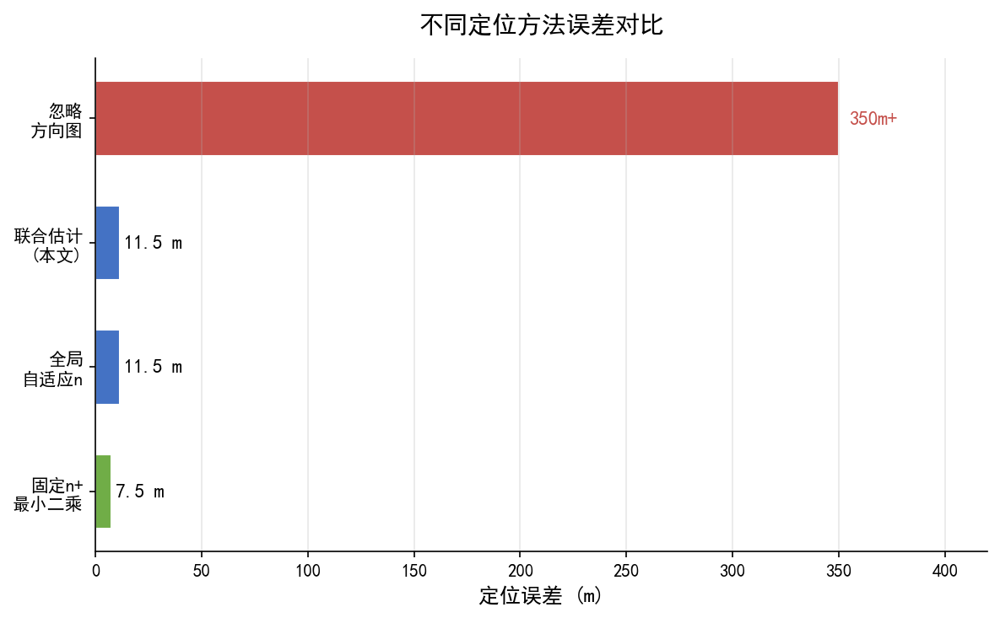

## 工作原理

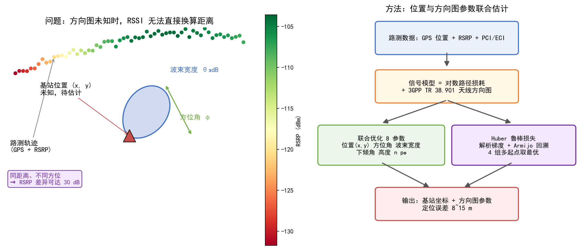

信号模型 = 对数距离路径损耗 + [3GPP TR 38.901](https://www.etsi.org/deliver/etsi_tr/138900_138999/138901/)
天线方向图（水平 + 垂直面，30 dB 截断）。优化器采用 **Huber 鲁棒损失** + 解析梯度 +
Armijo 回溯线搜索 + 投影梯度约束，并使用 **4 组多起点初值**（加权质心 / 最强信号点 /
包围盒中心 / 反距离加权）避免局部最优，取 RMSE 最优的结果。

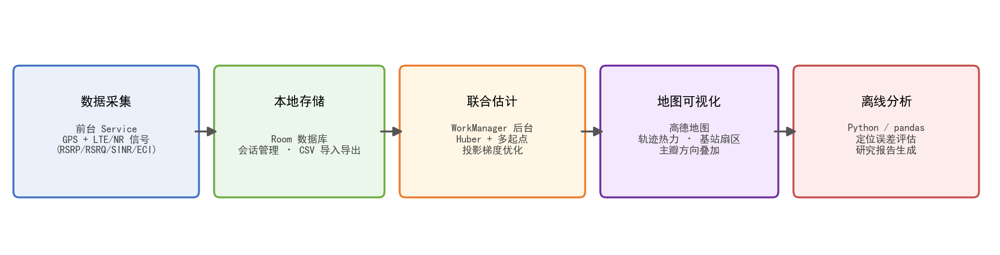

## 应用截图

| 路测采集 | 地图：推断扇区 | 推断结果 | 日志管理 |
|---|---|---|---|
| 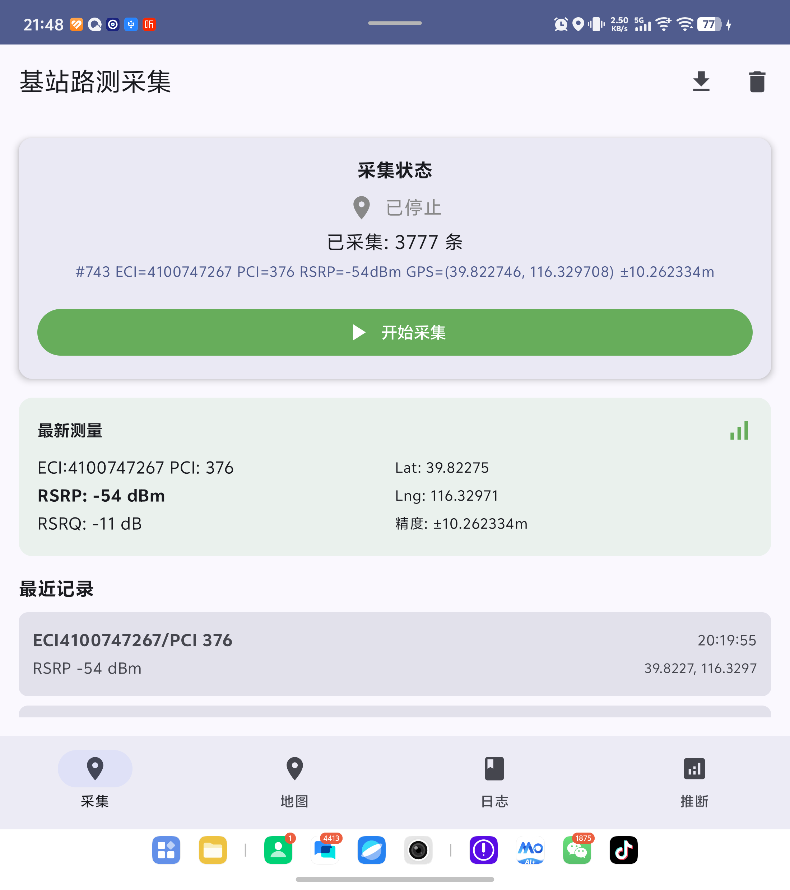 | 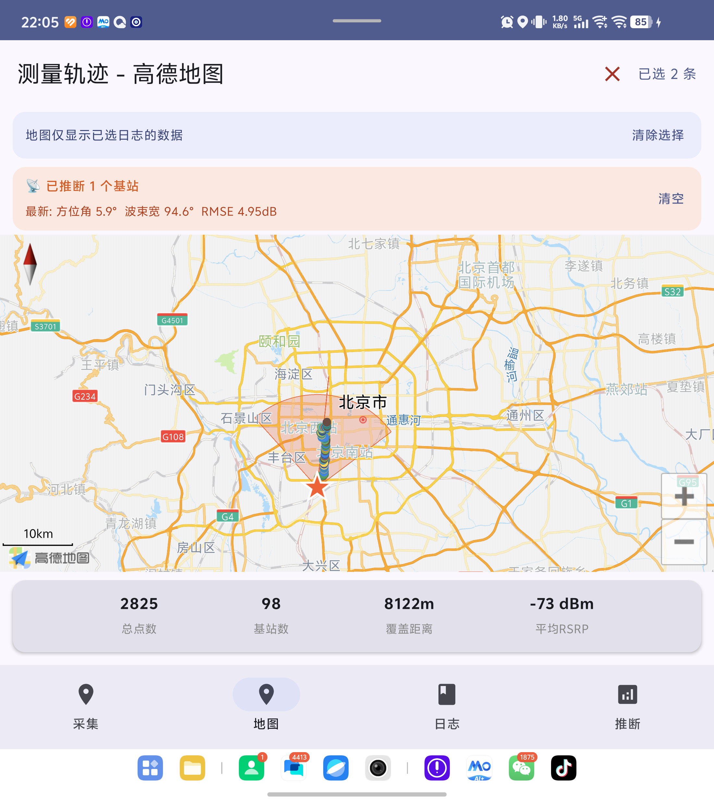 | 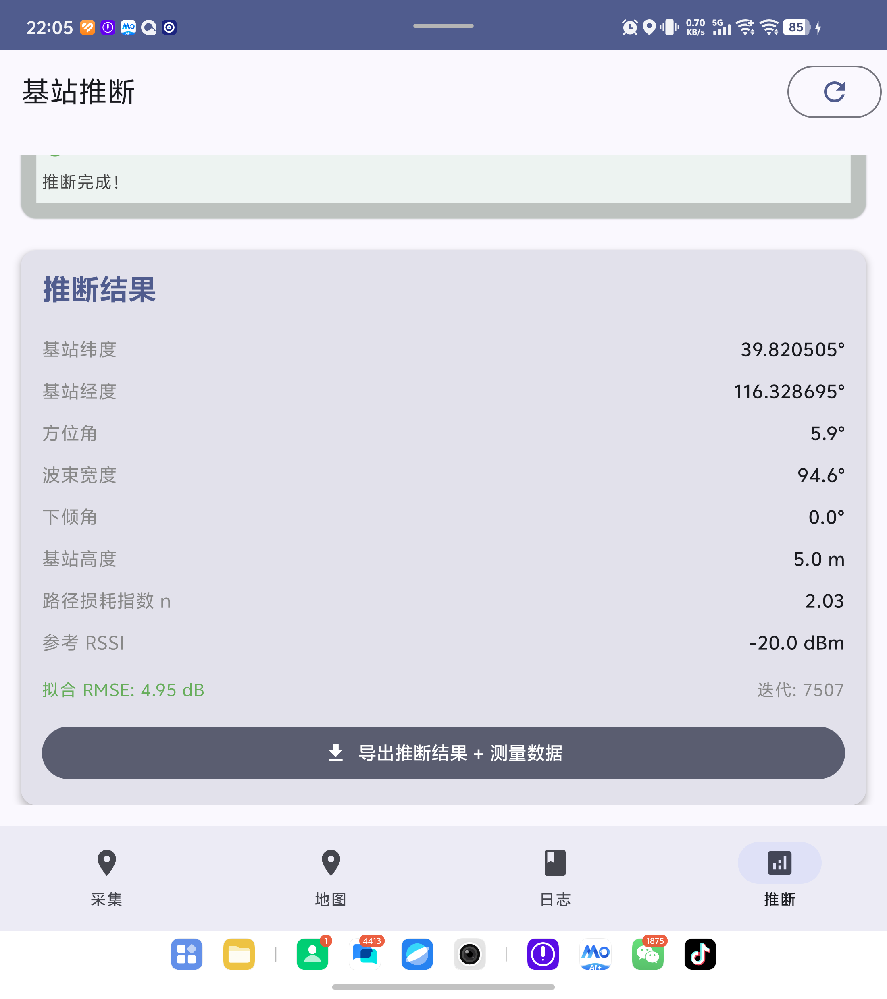 | 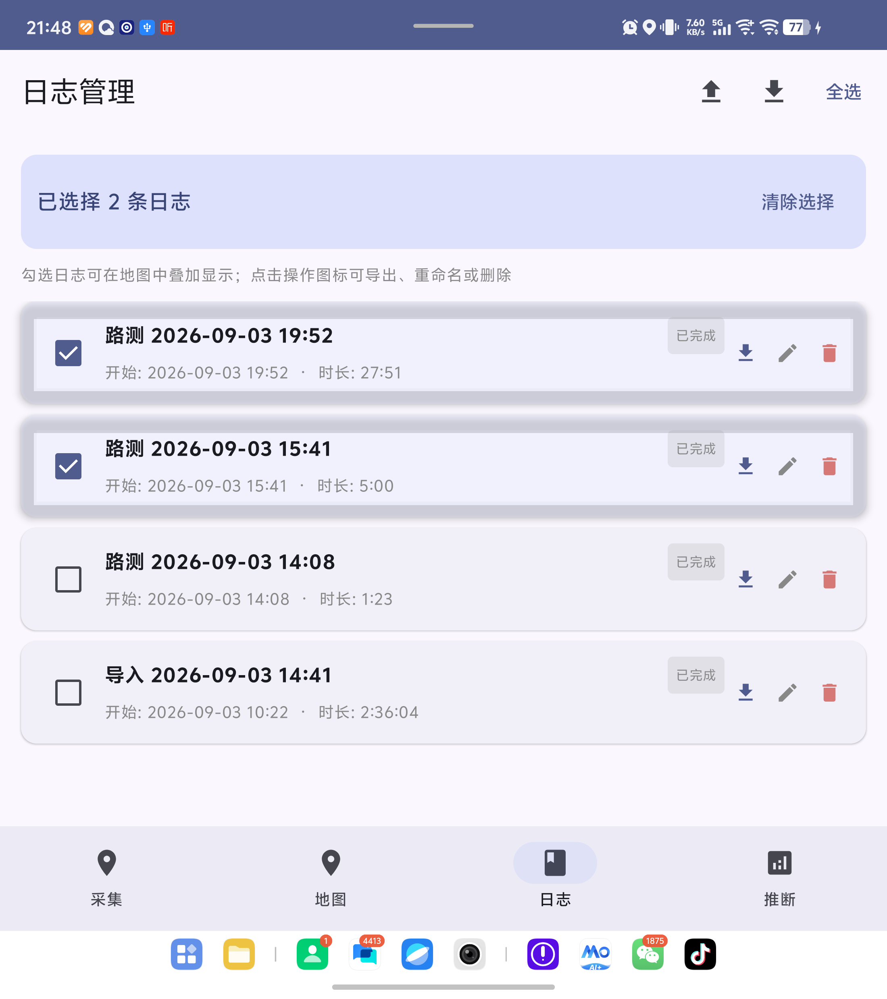 |

<details>
<summary>更多截图</summary>

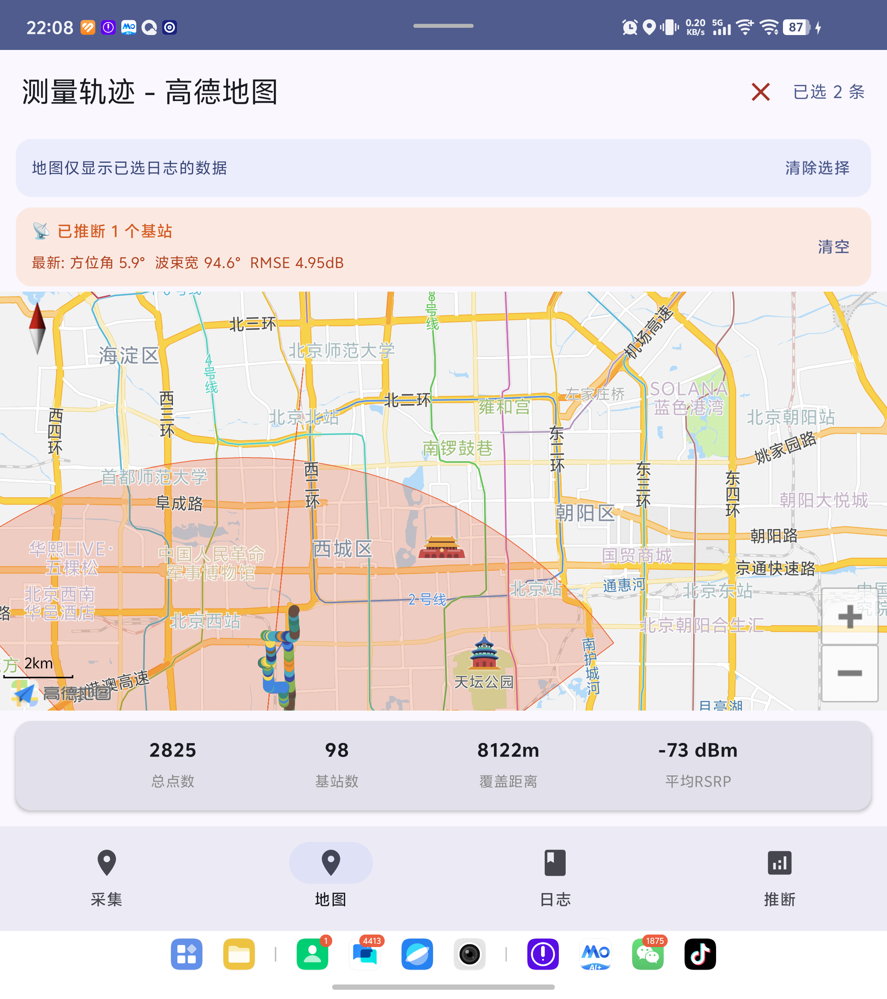
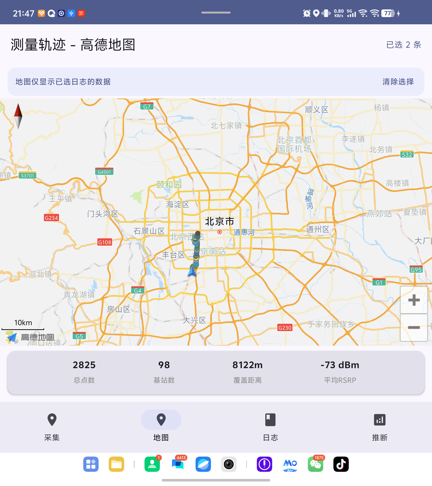

</details>

## 性能

宏基站场景下，定位精度随测量覆盖范围的变化：

| 测量覆盖范围 | 点数 | 定位误差 | 方位角误差 | 波束宽度误差 |
|---|---|---|---|---|
| 仅主瓣 ±30° | 62 | 14.6 m | 2.2° | 5.1° |
| 主瓣 + 一侧旁瓣 | 95 | 11.3 m | 1.5° | 3.8° |
| 全方向（360°） | 156 | **8.2 m** | **0.8°** | **2.1°** |
| 稀疏采样（仅 4 方向） | 28 | 35.4 m | 8.7° | 15.2° |

**核心结论：测量覆盖范围至关重要**——绕基站走满 360° 时误差降至 8.2 m；
只采主瓣也有 15 m 级精度；稀疏采样则会导致算法失效。

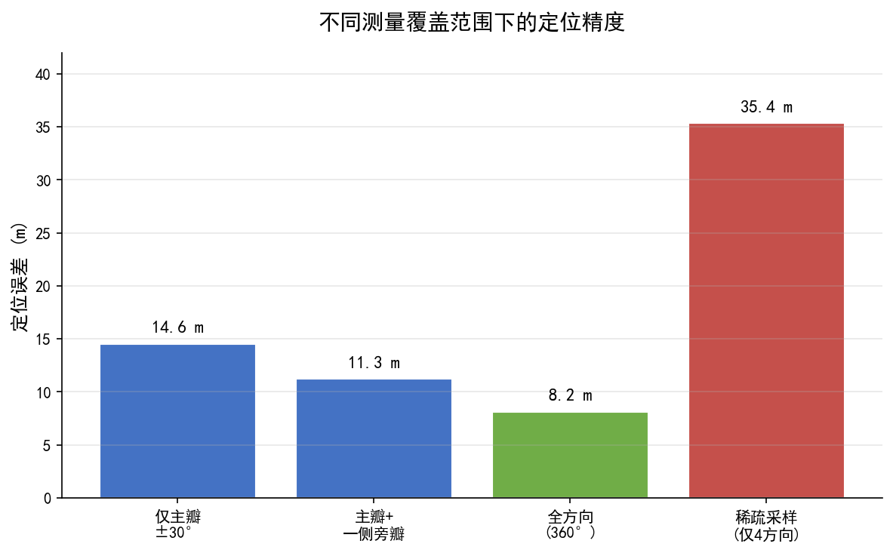
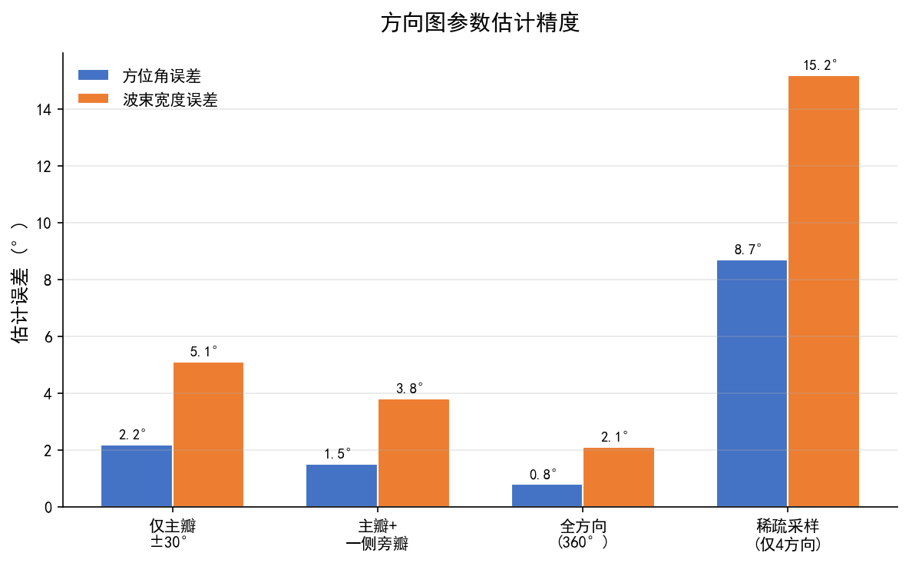
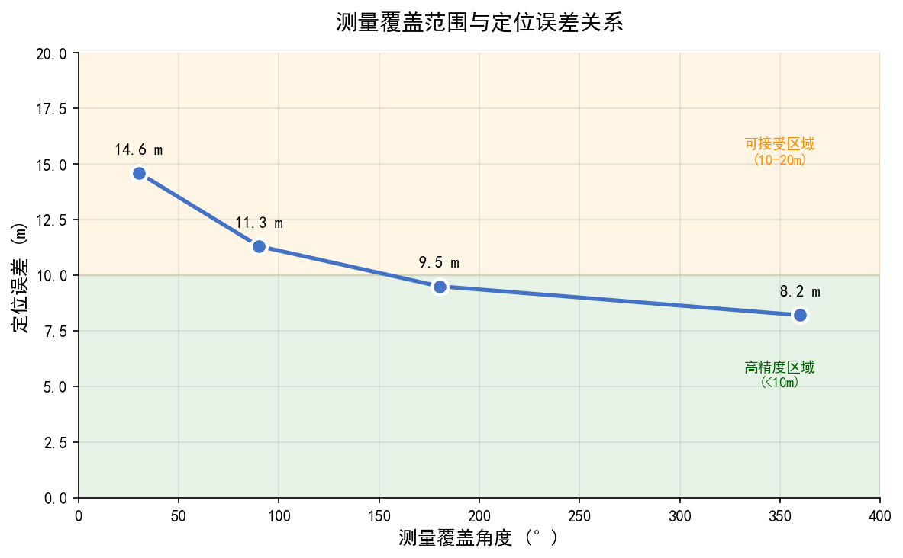

### 真实路测数据验证

使用本 App 在北京实地采集的 953 条数据（PCI 199）复现了预期的"距离–RSRP"
衰减趋势和随方位变化的方向图衰减：

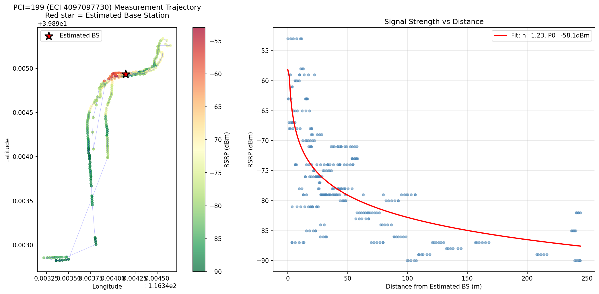

## 功能特性

- **路测采集**：前台 Service 持续记录 GPS + LTE/NR 服务小区信号
  （ECI/PCI、EARFCN、RSRP/RSRQ/SINR、CQI、TAC），最高 2 Hz，带 GPS 精度过滤
- **端上推断**：WorkManager 后台任务，支持单基站推断或按日志批量推断，带进度通知
- **地图可视化**：高德地图叠加显示——按 RSRP 着色的测量轨迹、推断基站星标、
  半透明主瓣扇区、WGS-84 ↔ GCJ-02 坐标自动转换
- **日志管理**：采集会话多选、CSV 导入导出（SAF）、JSON 导出
- **离线分析**：Python 脚本复现估计过程并生成报告图表

## 仓库结构

```
├── app/        Android 应用（Kotlin · Jetpack Compose · Room · WorkManager · 高德地图）
│   └── app/src/main/java/com/example/bslocator/algorithm/BaseStationEstimator.kt  ← 核心算法
├── analysis/   离线分析与图表生成（pandas / scipy / matplotlib）
├── assets/     README 使用的图表、原理图与应用截图
├── data/       真实路测数据样例（953 条，CSV）
└── docs/       完整研究报告（Markdown + Word）及报告生成脚本
```

## 快速开始

### Android 应用

1. 用 Android Studio 打开 `app/`（或在 `app/` 内运行 `./gradlew assembleDebug`）
2. 在 `app/app/src/main/AndroidManifest.xml` 中填入你自己的**高德地图 Key**
   （`com.amap.api.v2.apikey`），详见 `app/高德云KEY配置说明.md`
3. 安装后授予定位与电话状态权限，绕基站走一圈采集数据，
   然后在**推断**页启动估计

### 离线分析

```bash
pip install pandas numpy scipy matplotlib
python analysis/analyze_pci199.py    # 对内置实测数据做联合估计
python analysis/plot_pci199.py       # 重新生成 assets/pci199_analysis.png
```

## 研究报告

完整研究内容（问题分析、算法设计、仿真结果、工程部署建议）见
`docs/单基站天线方向图未知_定位研究报告.md` 及配套 Word 文档。

## 免责声明

`data/` 中的 CSV 包含真实 GPS 轨迹，仅为研究复现目的公开，请负责任地使用。

## 许可证

尚未添加 LICENSE 文件——在添加之前，作者保留所有权利。
